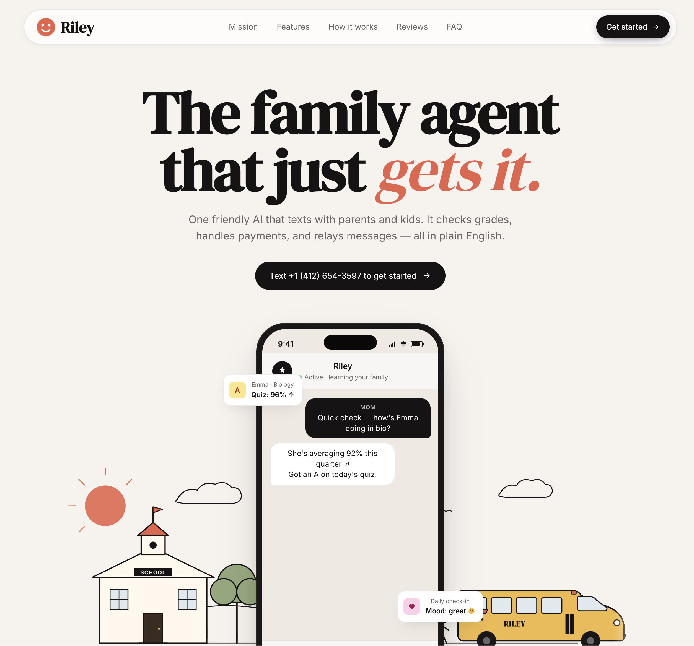

# Riley



**Your kid has a phone. Now they have an agent.**

1st Place: Best Use of Browser Use Track at the Call My Agent Hackathon.

One phone number for the whole family. Text it and Riley checks grades, monitors browsing, manages calendars, approves spending, and relays messages between parent and kid. No app. No login. Just text.

Built in 12 hours at the [Call My Agent Hackathon](https://events.ycombinator.com/CallMyAgentHackathon) @ YC.

[Watch the demo](https://youtu.be/vpZq3C_PlHc?si=DiRfaeQ_hslMdISl) | [Landing page](https://rileyapp.vercel.app/)

---

## How it works

Parent texts Riley's number. That's it.

```
parent: hey, i'm jacob. my kid is gaby and her number is 555-123-4567
riley:  got it, texting gaby now to confirm.
gaby:   yeah that's me
riley:  you're all set.

parent: how are gaby's grades?
riley:  checking now... [live browser link]
riley:  gaby has 100% on mobius 1, but assignments 2-6 are all 0%.
        she's behind. next step: get those submitted.

parent: what has gaby been browsing?
riley:  d2l study sessions, youtube (mrBeast), discord.
        flagged: one adult content site visit at 11:58pm.

parent: put dentist on gaby's calendar thursday 3pm
riley:  done, gaby's been notified.

gaby:   can you pay $2 for chegg?
parent: [gets notified] yeah go ahead
riley:  sent. $2.00 to gaby for chegg.

parent: tell gaby dinner is at 6
gaby:   [gets] from jacob via riley: dinner's at 6
```

The kid gets a heads-up before every parent action. Transparency by default.

---

## What's under the hood

```
iMessage/SMS  <-->  AgentPhone  <-->  FastAPI  <-->  OpenAI (tool-calling)
                                        |
                          +-------------+-------------+
                          |             |             |
                    Browser Use    Sponge Wallet   Supermemory
                    (grades)       (payments)      (memory)
```

**AgentPhone** is the backbone. Every iMessage in and out flows through it. Without it, Riley can't reach anyone.

**Browser Use** spins up cloud browsers with persistent profiles. Riley logs into UWaterloo D2L, reads the gradebook, and streams it live so the parent can watch in real time. One login carries across sessions.

**Sponge** moves real money on Solana. Kid asks, parent approves with "yeah", funds transfer. No checkout page, no redirect.

**Supermemory** stores family context across conversations. Grade snapshots, preferences, school info. Riley gets smarter over time.

**OpenAI** (GPT-5.4-nano) runs the orchestrator. One system prompt, 10 tools, every decision handled by the LLM. No routing logic, no intent classifier.

---

## Quick start

```bash
pip install -r requirements.txt
cp .env.example .env        # fill in your keys
bash go.sh                   # resets DB, starts server + ngrok
```

That's it. Text the AgentPhone number and go.

---

## Scripts

| Script | What it does |
|---|---|
| `go.sh` | Full reset + restart (the one you want) |
| `scripts/start.sh` | Boot server + ngrok, register webhook |
| `scripts/stop.sh` | Kill everything |
| `scripts/status.sh` | Check processes, tunnel URL, DB state |
| `scripts/logs.sh` | Tail server logs |
| `scripts/reset-db.sh` | Wipe DB + Supermemory, fresh schema |

---

## Troubleshooting

**D2L won't load?** Session expired. Re-run `./go.sh`.
**No reply from Riley?** Check `scripts/status.sh`. AgentPhone might be down.
**Payment failed?** Run `scripts/sponge-status.py` to check wallet balance.
**Browser timing out?** Set `BROWSER_TIMEOUT_SECONDS=240` in `.env`.

---

Thanks for reading this!